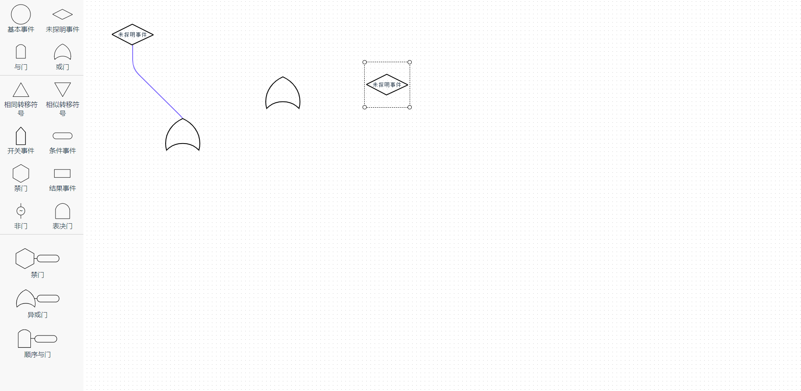

# &#128522;
# 我自己用的。
# for me
#### &#128640;[github](https://github.com/w569638598/obstacle-wl.git)

----

##### 导出方法 export methods
```javascript


import x6 from './x6'

const components = [x6]

function install(Vue){
    components.forEach(comp => {
        Vue.component(comp.name, comp)
    })
}

if(typeof window !== "undefined" && window.Vue){
    install(window.Vue)
}

export { x6 }

export default { install }
```
###### 导出数据 export data
```javascript
exportData(cb)
if(cb instanceof Function) cb(this.graph.toJSON(),this.graph);
      return this.graph.toJSON()
```

###### 获取实例

```javascript
getGraph(){
      return this.graph
    },
```


###### 渲染数据
```javascript
renderData(data: cellJSONObject)
```
---- 


###### 快捷键
-----------------
| 名称 | 方法 | 注释 |
| :----| :----| ----|
|复制|ctrl+c|点击节点后按ctrl+c|
|粘贴|ctrl+v|复制后按ctrl+v|
|框选|ctrl+按下鼠标左键拖动|
|删除|delete|选中节点后按delete|
|批量粘贴||框选后按ctrl+v|
|批量删除||框选后按delete|
|点选|ctrl+鼠标左键单击|


###### 效果图预览
&#128640;[github](https://github.com/w569638598/obstacle-wl.git)

